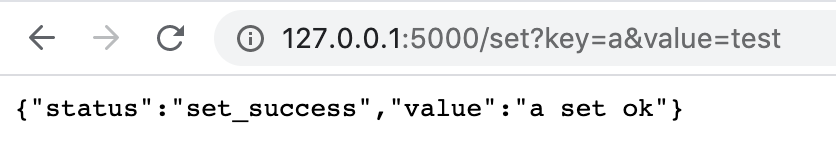
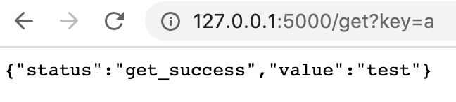
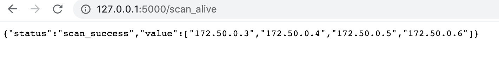
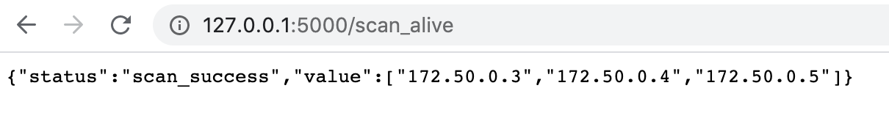
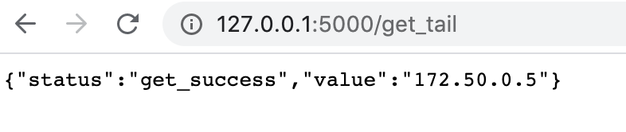
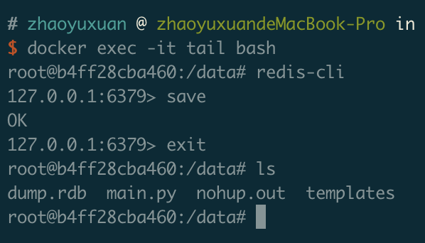
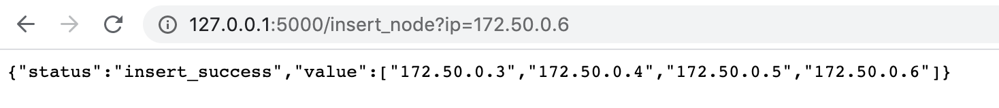
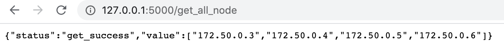

# 基于Chain Replication的k,v存储系统

**代码架构**

```
project
│
│   docker-compose.yml
│   Chain Replication.pptx    
│   command.txt
│   
└───master
│   │   main.py
│   │   config.py
│   │   Dockerfile
│   │
│   └───templates
│       │   index.html
│   
└───master
│   │   main.py
│   │   Dockerfile
│   │
│   └───templates
│       │   index.html
│
│     
```

------

**系统运行**

```bash
#一键启动所有节点
docker-compose up -d
#启动所有节点内的服务(command.txt)
docker exec -it master bash
nohup python3 main.py &
exit
...
...

```

**Chain Replication插入操作**



**Chain Replication查询操作**



**Chain Replication监控链存活**



**手动关闭172.50.0.6**
**docker stop tail**



**master将旧tail节点的前置节点172.50.0.5置为新的tail节点**




**插入新节点**

1.先保存redis数据 dump.rdb



2.启动新的redis节点

3.向master告知新插入的ip



4.插入成功



